# PRATIKUM 3 MEMBUAT LIST, TABLE DAN FORM
Tugas ini di buat untuk memenuhi tugas pertemuan ke empat

Nama  : Mulifatkhul Rachiim

NIM   : 312010180

Kelas : TI.20.B1

# LANGKAH - LANGKAH PRATIKUM

1. Buatlah Dokumen HTML dengan nama Lab3_list.html kemudian tambahkan
kode untuk membuat _Order list_ seperti berikut :
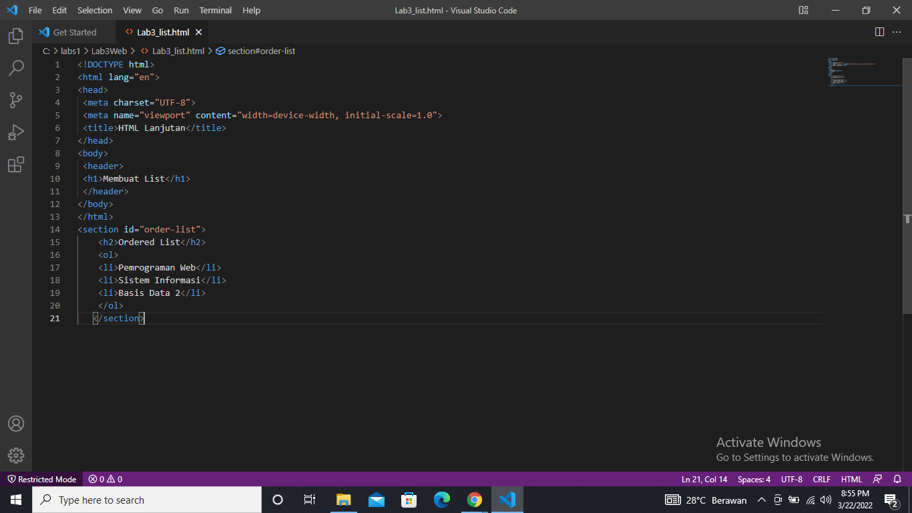

2. selanjutnya buka browser untuk melihat hasilnya

3. Kemudian tambakan kode untuk membuat Unordered List, setelah deklarasi ordered list pada section unordered-list, seperti berikut
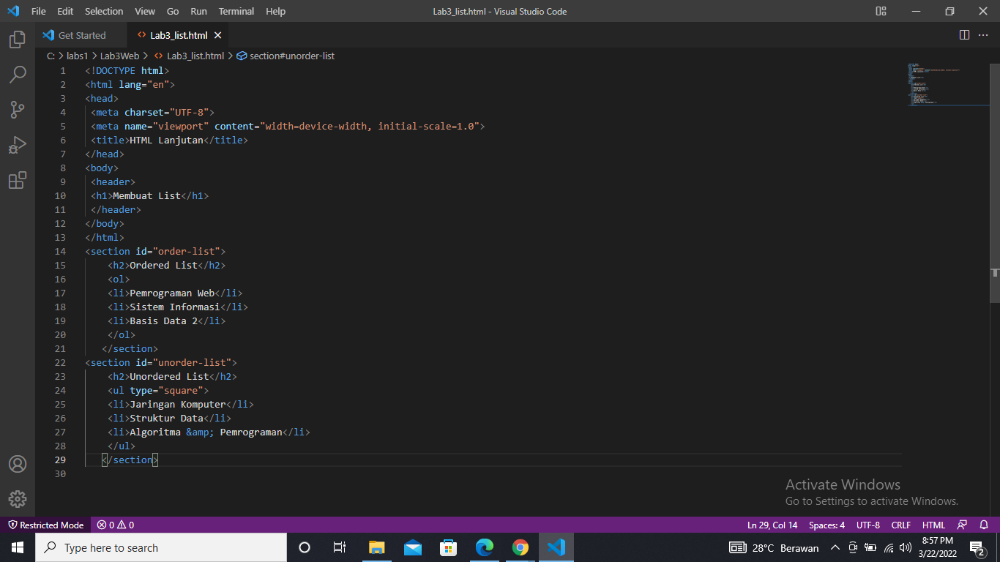

4. Kemudian selanjutnya, buka file tersebut pada web browser 
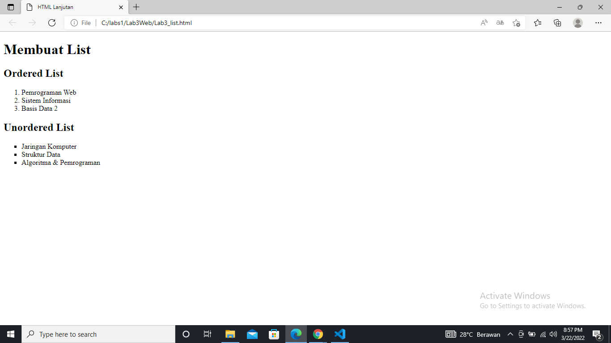

5. Kemudian tambahkan kode untuk membuat description list setelah deklarasi unorderd-list
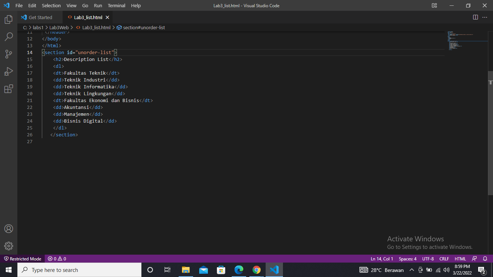

6. setelah di save buka file tersebut pada web browser
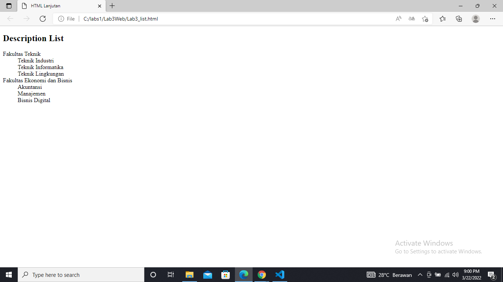

Selanjutnya lakukan eksperimen lain terkait list dan penggunaan atribut type pada list.

_Membuat Tabel_
Buat file baru dengan nama lab3_tabel.html seperti berikut

Kemudian selanjutnya tambahkan kode untuk membuat tabel sederhana seperti berikut:
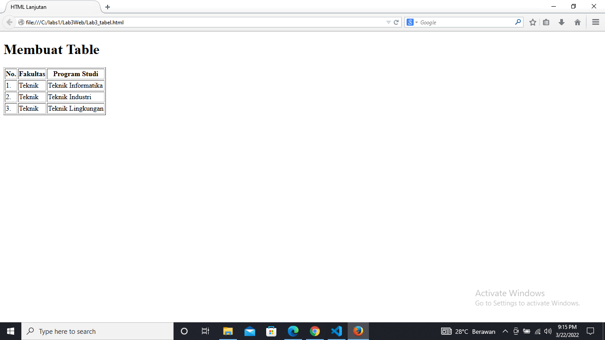

_Mengatur Margin dan Padding_
Untuk mengatur margin dan padding pada cel data, tambahkan atribut cellpadding dan 
cellspacing pada tag table.
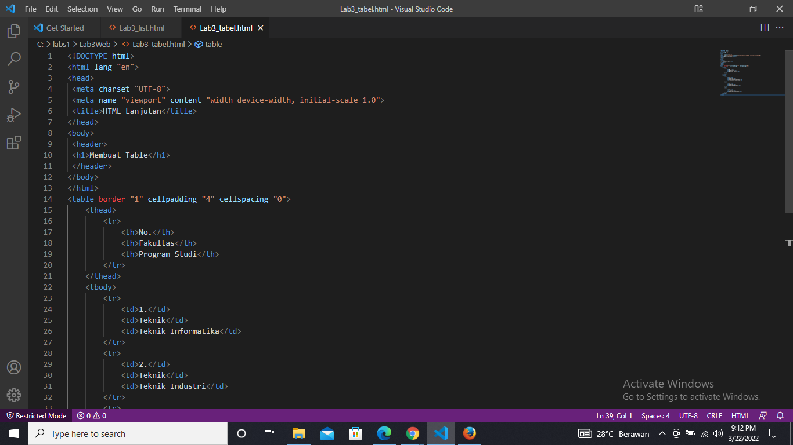

kemudian save setelah itu buka di browser untuk melihat hasilnya
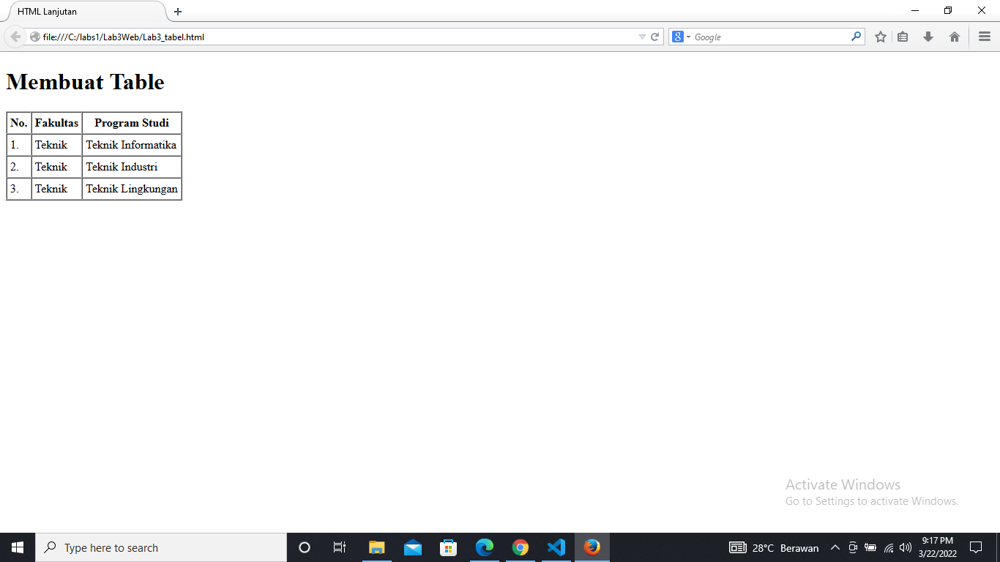

_Menggabungkan Sel Data_
Untuk menggabungkan sel data, gunakan atribut rowspan dan colspan. Atribut rowspan untuk 
menggabungkan baris (secara vertikal) dan colspan untuk menggabungkan kolom (secara 
horizontal).
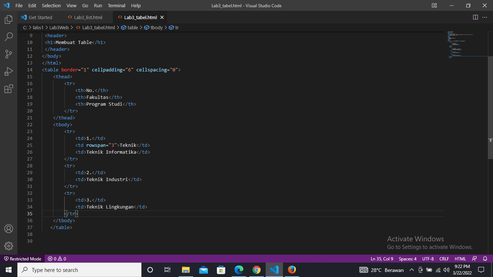

selanjutnya di save dan buka browser untuk melihat hasilnya
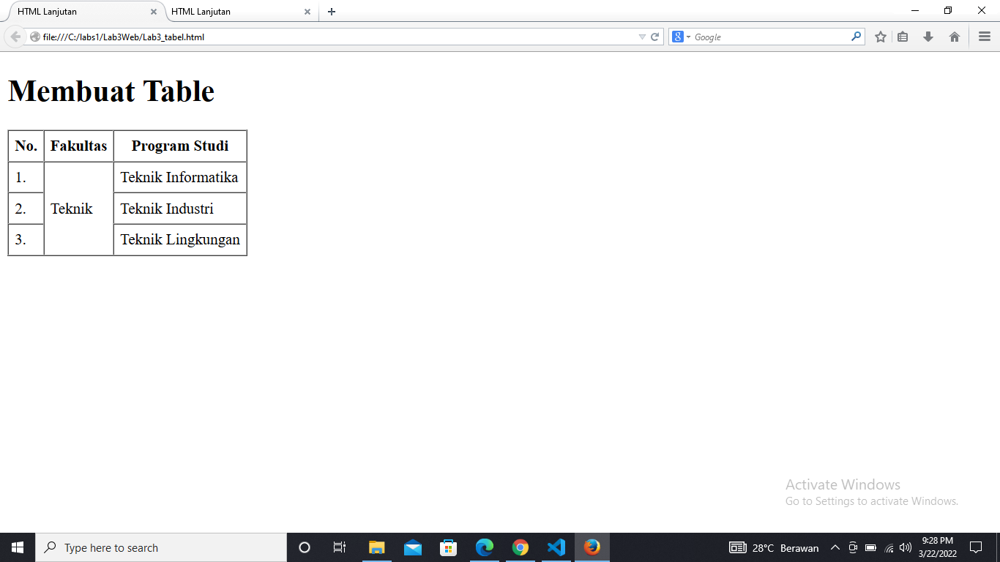

_Membuat Form
Buat file baru dengan nama lab3_form.html seperti berikut._
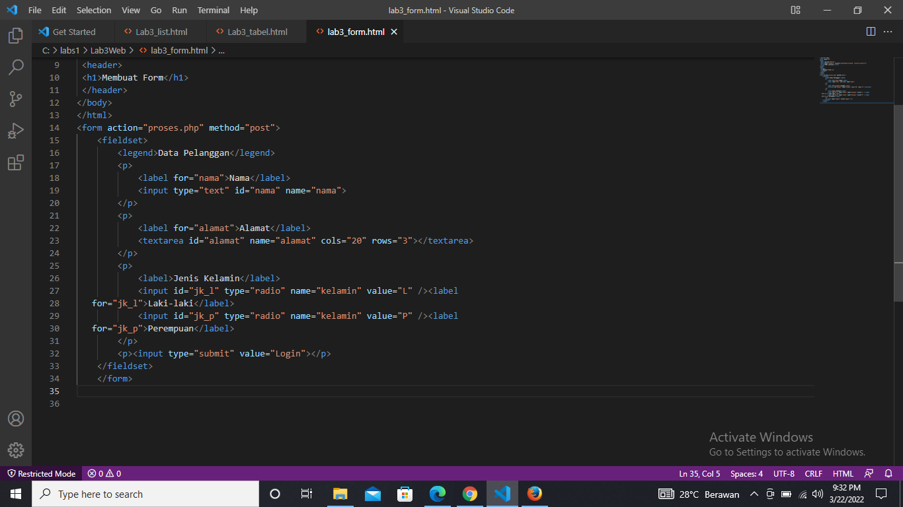

Kemudian selanjutnya tambahkan kode untuk membuat tabel sederhana seperti berikut setelah itu di save untuk melihat hasilnya di browser
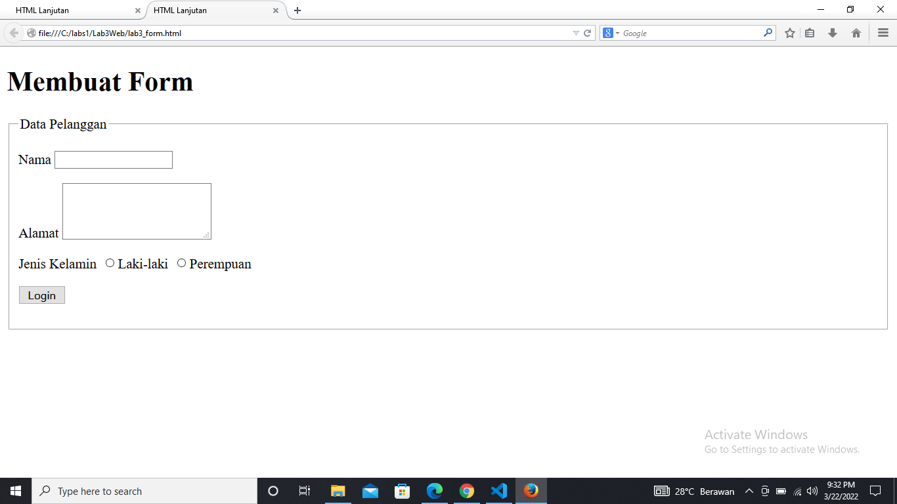

Menabahkan Style pada Form
Agar tampilan form lebih menarik, bisa ditambahkan CSS seperti berikut, setelah itu di save untuk melihat hasilnya di browser
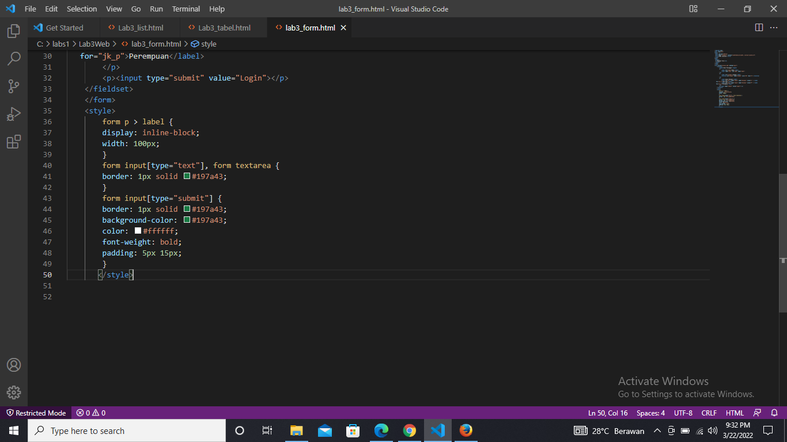

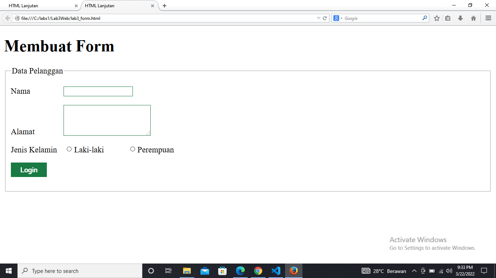

sekian dari saya
semoga bermanfaat yaa 
wassalamualaikum wr wb

